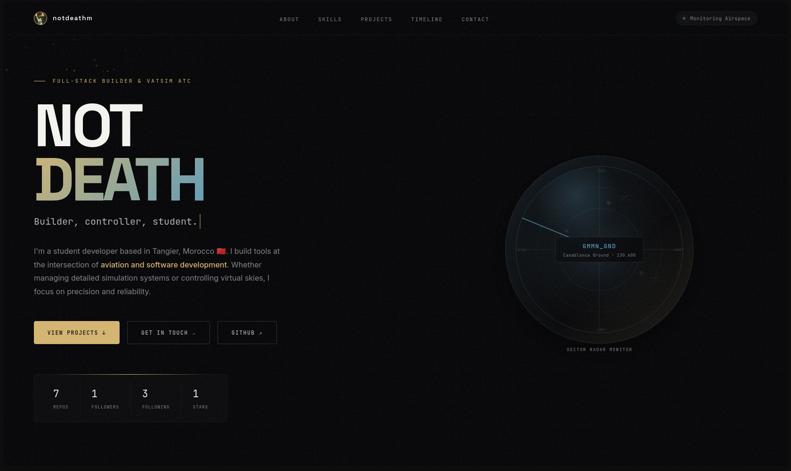
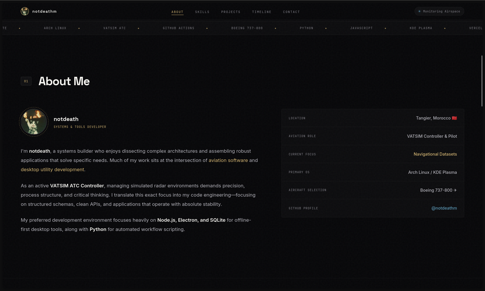
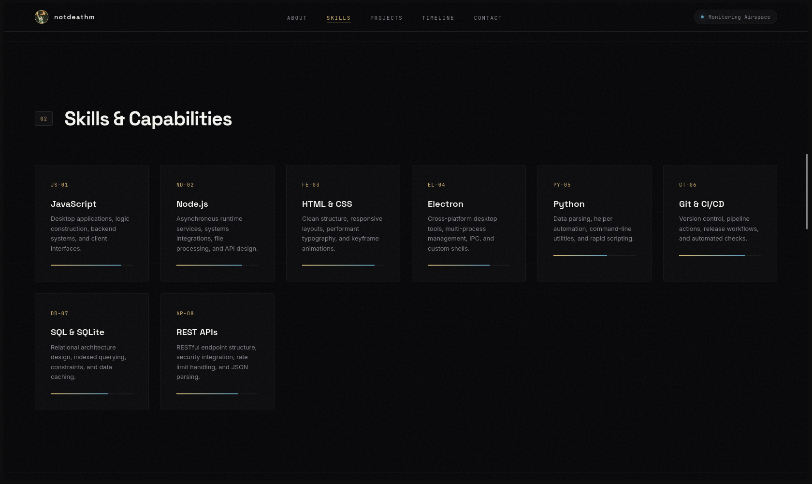
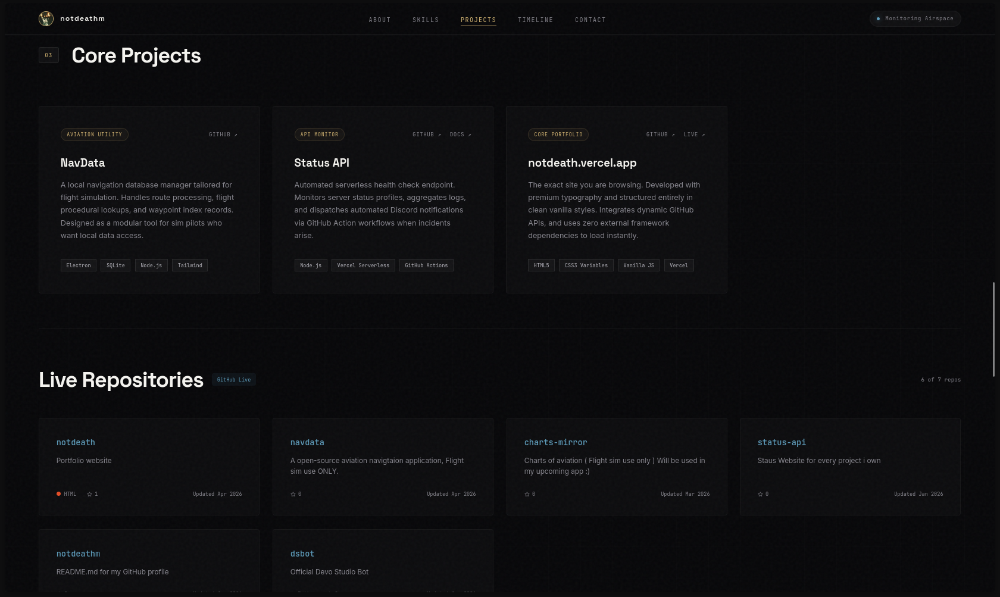
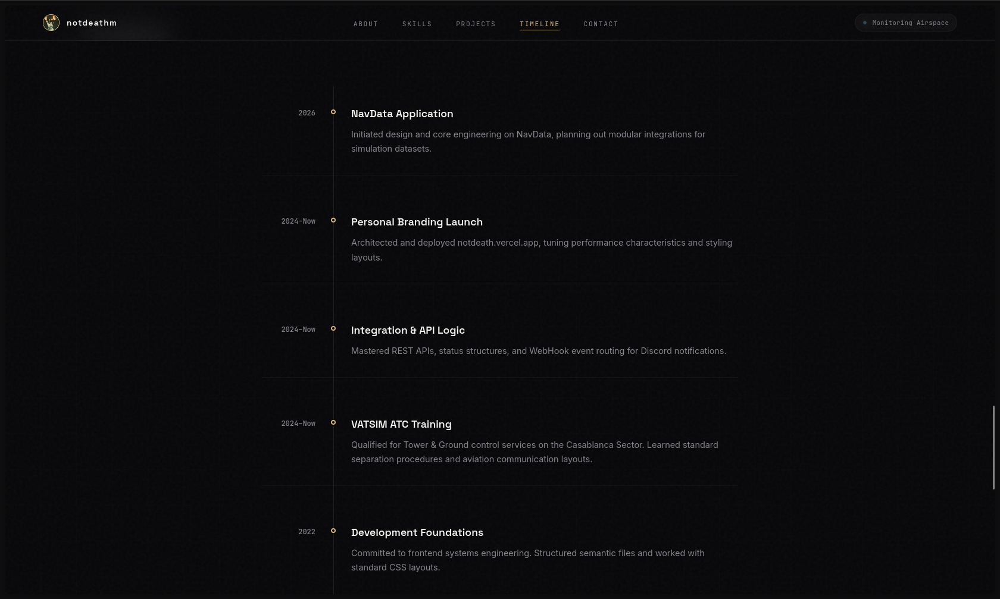

  

   

  

    
    
    
    
  

  <h3 align="center">Aviation-Inspired High-Performance Portfolio</h3>

  

    <strong>An immersive, high-performance personal portfolio built with premium aesthetics and zero heavy framework bloat.</strong>
     
     
    <a href="https://notdeath.vercel.app"><strong>Live Demo</strong></a> ·
    <a href="#-features"><strong>Features</strong></a> ·
    <a href="#-tech-stack"><strong>Tech Stack</strong></a>
  

---

## ⚡ Overview

A showcase of my projects, skills, and timeline as a developer and simulator enthusiast. The layout draws deep inspiration from aviation radar screens and ATC monitors, combined with a premium dark mode, glassmorphism layers, and warm gold accents.

Built entirely with **Vanilla HTML5, CSS3, and JavaScript**, this application runs with zero framework overhead, delivering instant loading speeds and a 100/100 Lighthouse performance profile.

*(Note: Mentions of the NavData project have been removed from this portfolio as its development has been permanently halted.)*

## ✨ Features

- 🎨 **Premium Aesthetic**: Clean glassmorphism components, grid overlays, and a curated dark palette with warm gold and aviation blue accents.
- 📡 **Interactive ATC Radar**: A customized SVG vector radar monitor featuring rotation sweep filters, compass degree rings, and flight track data blocks.
- ✨ **Atmospheric Effects**: Low-overhead HTML5 Canvas floating particles that run in the background without interrupting page rendering.
- 📊 **Dynamic GitHub Stats**: Live profile statistics (Repositories, Followers, Stars, Following) fetched at run-time with shimmering skeleton screens.
- 📂 **Auto-fetched Projects**: Displays source projects directly from the GitHub API, styled with cursor-tracking gradient illumination.
- 📬 **AJAX Contact Routing**: Zero-redirect email messaging utilizing FormSubmit AJAX headers and interactive validation cues.
- ⚙️ **PWA Caching**: Integrated PWA support with a customized Service Worker (`sw.js`) that caches files for offline accessibility.

## 🛠️ Tech Stack

  <table>
    <tr>
      <td align="center" width="25%">
         
        <b>Structure</b>
      </td>
      <td align="center" width="25%">
         
        <b>Styling</b>
      </td>
      <td align="center" width="25%">
         
        <b>Logic</b>
      </td>
    </tr>
  </table>

- **Fonts:** Space Grotesk (Headings), Inter (Body copy), JetBrains Mono (Technical readouts)
- **APIs & Services:** FormSubmit (AJAX Form routing), GitHub API, Vercel Serverless CDN
- **Browser APIs:** HTML5 Canvas API, IntersectionObserver, LocalStorage Caching, Fetch API

## 📸 Screenshots

<b>Click to view screenshots</b>

### 🖥️ Desktop

| Desktop View 1 | Desktop View 2 |
| :---: | :---: |
|  |  |
|  |  |
|  | |

### 📱 Mobile

| Mobile View 1 | Mobile View 2 |
| :---: | :---: |
|  |  |

## 📄 License

Distributed under the MIT License. See [`LICENSE`](LICENSE) for more information.

---

**[Website](https://notdeath.vercel.app)** • **[Twitter](https://twitter.com/notdeath_m)** • **[GitHub](https://github.com/notdeathm)**

 
<em>Built with assistance from Google Gemini.</em>

