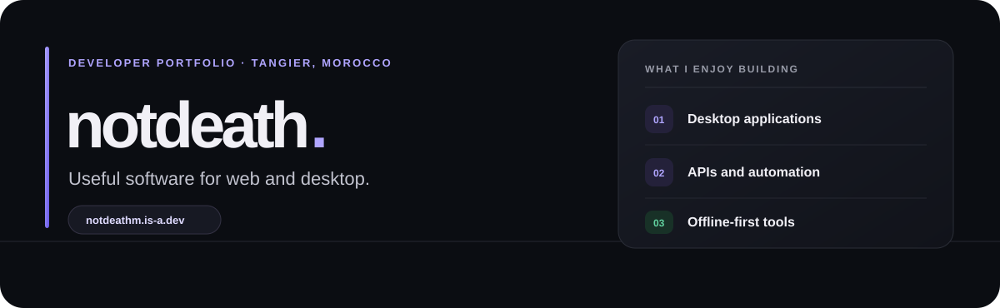

<p align="center">
  
</p>

<h1 align="center">notdeath · Developer Portfolio</h1>

<p align="center">
  <strong>Student developer · Tangier, Morocco</strong><br>
  A personal home for selected projects, the tools I use, and a simple way to get in touch.
</p>

<p align="center">
  <a href="https://notdeathm.is-a.dev/"><strong>Visit the portfolio ↗</strong></a> ·
  <a href="https://github.com/notdeathm/notdeathm.github.io">Browse the source</a> ·
  <a href="mailto:notdeath@duck.com">Email me</a>
</p>

<p align="center">
  
  
  
</p>

---

## What this is

A dark, responsive, single-page developer portfolio built with semantic **HTML**, modern **CSS**, and plain **JavaScript**. There is no framework, package manager, or build step: the site can be served directly from this repository.

## Featured projects

### [Status API ↗](https://notdeathm.is-a.dev/statusapi/)

A static status page with automated service checks, uptime history, maintenance notices, and public JSON endpoints. Built with Next.js, TypeScript, and GitHub Actions.

[Source code](https://github.com/notdeathm/statusapi)

### [Portfolio ↗](https://notdeathm.is-a.dev/)

This site: a lightweight place to explore my work and get in touch, built without a front-end framework.

[Source code](https://github.com/notdeathm/notdeathm.github.io)

## Highlights

- **A focused layout:** a simple path through the introduction, selected projects, about, toolkit, and contact.
- **A floating navigation bar:** stays visible while scrolling and adapts to small screens.
- **Dark-first styling:** responsive layouts, reduced-motion support, visible keyboard focus, and a skip-to-content link.
- **Direct contact:** an AJAX contact form with a visible email fallback.
- **Search and sharing metadata:** canonical URL, social tags, structured data, and a sitemap for the custom domain.
- **Basic offline support:** a network-first service worker caches the home page, manifest, and icon.

## Run it locally

No dependencies to install. From the repository root, start a static server:

```sh
python3 -m http.server 8000
```

Then visit <http://localhost:8000>.

## Repository map

| Path | Purpose |
| --- | --- |
| `index.html` | Page content, styles, navigation, and contact-form behavior |
| `assets/icon.png` | Site and app icon |
| `assets/readme-banner.svg` | This README’s cover image |
| `manifest.json` | Installable web app metadata |
| `sw.js` | Offline app-shell caching |
| `sitemap.xml` | Search-engine sitemap |
| `CNAME` | Custom domain: `notdeathm.is-a.dev` |
| `CHANGELOG.md` | Project history |

## Deployment

GitHub Pages is configured to publish the repository root from `main`. The `CNAME` file points to `notdeathm.is-a.dev`; after a change is merged to `main`, GitHub Pages builds and deploys it automatically.

## External services

The page loads Google Fonts and Google Analytics. The contact form is handled by FormSubmit; a direct `mailto:` link is provided as a fallback.

## License

MIT — see [`LICENSE`](LICENSE).
